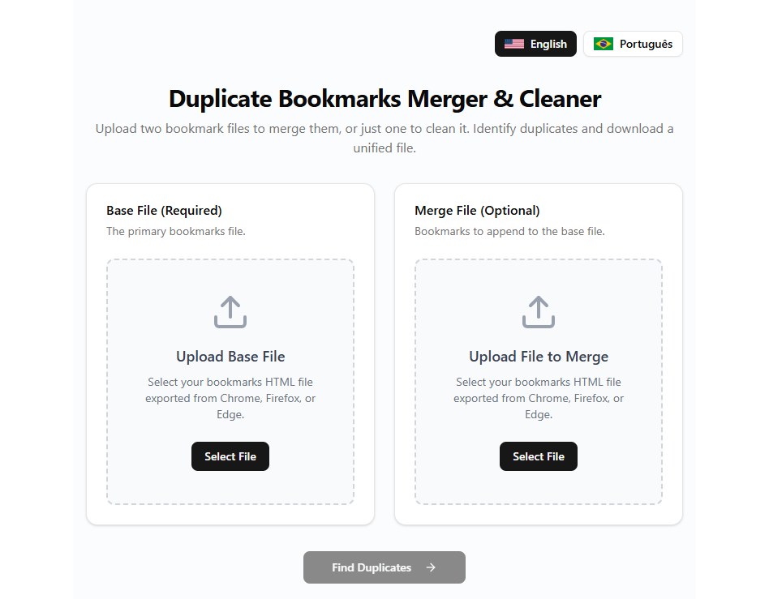
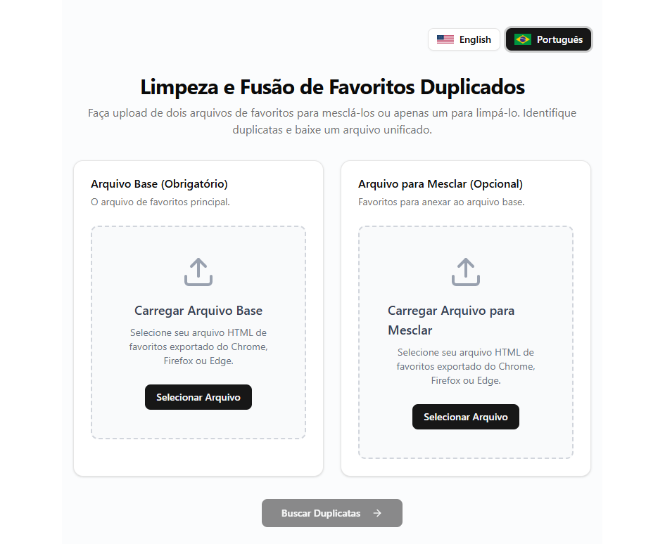

# Limpeza e Fusão de Favoritos Duplicados

<div style="display: flex; justify-content: space-between; flex-wrap: wrap;">


</div>

## Sobre o Projeto
Este é um aplicativo web moderno desenvolvido para ajudar usuários a gerenciar seus favoritos do navegador. Ele resolve o problema comum de ter milhares de favoritos desorganizados e duplicados ao permitir fazer upload de arquivos de favoritos (exportados do Chrome, Firefox, Edge, etc.), mesclar dois arquivos diferentes e identificar automaticamente duplicatas para limpeza.

## Funcionalidades Principais
*   **Upload de Arquivos**: Suporte para upload de um ou dois arquivos HTML de favoritos (formato Netscape Bookmark).
*   **Fusão Inteligente**: Mescla o conteúdo de um segundo arquivo no primeiro, preservando a estrutura de pastas original.
*   **Detecção de Duplicatas**: Identifica URLs duplicadas em todo o conjunto de favoritos, independentemente da pasta onde estejam (comparação global).
*   **Comparação Detalhada**: Exibe duplicatas lado a lado, mostrando o título, a pasta completa e o arquivo de origem (Arquivo 1 vs Arquivo 2) para facilitar a decisão de qual manter.
*   **Internacionalização (i18n)**: Interface totalmente traduzida para Português (BR) e Inglês (US), com troca instantânea.
*   **Limpeza Segura**: Permite selecionar quais duplicatas remover e gera um novo arquivo limpo e pronto para importação.

## Tecnologias Utilizadas
*   **Framework**: [Next.js 14](https://nextjs.org/) (App Router)
*   **Linguagem**: [TypeScript](https://www.typescriptlang.org/)
*   **Estilização**: [Tailwind CSS](https://tailwindcss.com/)
*   **Componentes UI**: [shadcn/ui](https://ui.shadcn.com/)
*   **Ícones**: [Lucide React](https://lucide.dev/)

## Como Executar o Projeto

### Pré-requisitos
*   Node.js (versão 18 ou superior)
*   npm (gerenciador de pacotes)

### Passo a Passo
1.  **Clone o repositório** (ou baixe os arquivos):
    ```bash
    git clone <url-do-repositorio>
    cd favoritos-duplicados
    ```

2.  **Instale as dependências**:
    ```bash
    npm install
    ```

3.  **Execute o servidor de desenvolvimento**:
    ```bash
    npm run dev
    ```

4.  **Acesse no navegador**:
    Abra [http://localhost:3000](http://localhost:3000) para ver a aplicação rodando.

## Como Usar
1.  **Upload**:
    *   Selecione o "Arquivo Base" (seus favoritos principais).
    *   (Opcional) Selecione o "Arquivo para Mesclar" se quiser juntar favoritos de outro navegador ou backup antigo.
2.  **Processamento**:
    *   Clique em "Buscar Duplicatas" (ou "Mesclar e Buscar").
3.  **Revisão**:
    *   O sistema mostrará os grupos de favoritos duplicados.
    *   Verifique a coluna "Pasta" para ver a origem de cada favorito (ex: *File 1* ou *File 2* e o caminho da pasta).
    *   Marque as caixas de seleção dos itens que deseja **remover**.
4.  **Limpeza e Download**:
    *   Clique em "Remover Selecionados".
    *   Confirme a ação no modal.
    *   O download do arquivo `bookmarks_merged_cleaned.html` iniciará automaticamente.
5.  **Importação**:
    *   Vá ao seu navegador, abra o gerenciador de favoritos e escolha a opção "Importar Favoritos".
    *   Selecione o arquivo gerado.

## Estrutura do Projeto
*   `src/app`: Páginas e layout do Next.js.
*   `src/components`: Componentes React reutilizáveis (Tabela de Duplicatas, Upload de Arquivo, Seletor de Idioma).
*   `src/lib`: Lógica de negócio (parsing de HTML, busca de duplicatas, geração de arquivo, dicionários de tradução).
*   `public`: Arquivos estáticos e documentação.

## Licença

Este projeto está licenciado sob a Licença MIT - veja o arquivo [LICENSE](LICENSE) para detalhes.

## Autor

**Bruno Guimarães**